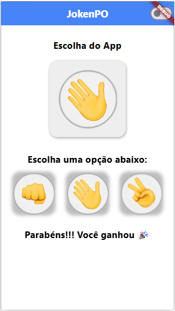

# 📱Flutter JokenPo

## 🚀 About the Project
Flutter JokenPo is an interactive and lightweight mobile game developed with Flutter, inspired by the classic Rock, Paper, Scissors game. The application provides a seamless user experience with a clean UI, randomized AI-based gameplay, and smooth animations.

Key Features:

- Real-Time Game Logic: Implements real-time game mechanics, instantly determining the winner after each move.
- Randomized AI Opponent: Uses Dart’s Random() class to simulate unpredictable computer-generated moves.
- Smooth UI/UX: Built with Flutter’s Material Design, ensuring a modern and responsive interface.
- Dark Mode & Light Mode Support: The app adapts to the device's system theme for a better user experience.
- Lightweight & Fast: Optimized for low memory consumption and smooth performance on different devices.
- Replay Anytime: Instant game restart after each round, allowing continuous play.

The primary goal of Flutter JokenPo is to provide a fun and engaging game experience while exploring Flutter's core functionalities like state management, randomization, and responsive UI design.

## 🖼 Light Mode & Dark Mode Screenshots

### Light & Dark Mode  

   &nbsp;&nbsp;&nbsp;&nbsp;
  

## 🛠 Technologies Used
- Language: Dart
- Framework: Flutter
- State Management: setState() (for UI updates)
- UI & Design: Flutter Material Design with Dark Mode support
- Randomization: Dart’s built-in Random() class for AI opponent moves
- Device Compatibility: Android, iOS, and Web

## 📋 Requirements
- Platform: Android 5.0+ / iOS 12+ / Web
- Tools: Flutter SDK 3.10+, Dart 3.0+
- Editor: Recommended: VS Code or Android Studio
- Internet Connection: Not required for basic gameplay

## 🎯 Learning Objectives
During the development of Flutter JokenPo, several technical concepts were implemented and enhanced, including:

- Randomized AI Logic: Utilizing Dart’s Random() class for unpredictable game behavior.
- State Management: Using setState() to update UI dynamically after each move.
- Flutter UI Components: Creating an interactive interface with Material Design widgets.
- Cross-Platform Development: Ensuring compatibility across Android, iOS, and Web.
- Performance Optimization: Keeping the app lightweight for smooth and responsive gameplay.

Developed to deliver a fast, fun, and intuitive gaming experience for all users!
